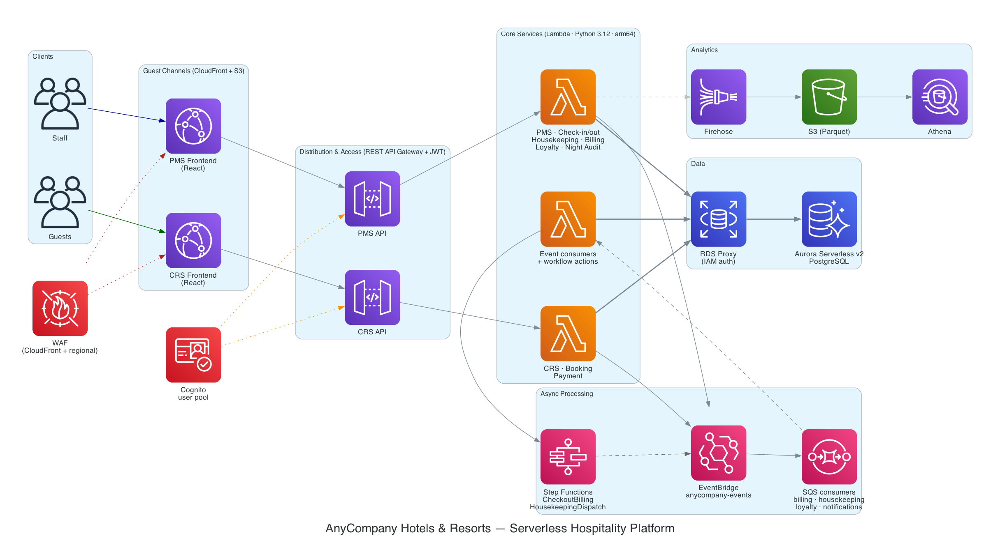

# AnyCompany Hotels & Resorts — Serverless Hospitality Platform

A serverless hospitality platform on AWS that pairs a public **Central Reservation System (CRS)** booking website with a staff **Property Management System (PMS)** dashboard. Guests book rooms on the CRS; staff run day-to-day operations on the PMS. Both share one Aurora Serverless v2 database, one Cognito user pool, and one EventBridge bus, and are deployed end-to-end by a single AWS SAM template.

## Features

- **Central Reservation System (CRS)** — public booking website. Browse 50 US properties, check live availability, build a cart, apply promo codes, and pay with Stripe.
- **Property Management System (PMS)** — staff dashboard. Check-in / check-out, room assignment, housekeeping, folio billing, night audit, loyalty, and reporting — all scoped by role and property.
- **Event-driven core** — services communicate asynchronously over an EventBridge bus (`anycompany.{domain}` / `{entity}.{action}`), with SQS consumers and two Step Functions workflows orchestrating checkout billing and housekeeping.
- **Multi-tenant by design** — property- and region-level isolation is enforced in every PMS handler from the Cognito JWT; chain-level roles see the whole estate, regional roles see a region, property staff see one property.
- **Loyalty & payments** — Stripe tokenized payments (no raw card data stored) and a points program that earns automatically on checkout.
- **Production-leaning infrastructure** — RDS Proxy with IAM auth, dual-scope WAF (CloudFront + regional), gateway request validation, and a layered test suite with an API contract regression net.

## Architecture



The platform is organized into six layers — Guest Channels, Distribution & Access, Core Hotel Systems, Operational Systems, Finance & Guest Intelligence, and Infrastructure — connected by an asynchronous event bus. Two React frontends (CRS and PMS) are served from separate CloudFront distributions but share the Cognito pool. Each frontend talks to its own REST API Gateway, which fronts a fleet of Python 3.12 Lambda functions. Those Lambdas read and write a single Aurora Serverless v2 PostgreSQL database through RDS Proxy (IAM auth), and publish domain events to EventBridge. SQS consumers and Step Functions state machines pick those events up to drive billing, housekeeping, loyalty, and notifications without blocking the request path. A Firehose → S3 → Athena pipeline captures analytics.

For the full six-layer design, event catalog, and data models, see **[HOSPITALITY_PLATFORM_ARCHITECTURE.md](./HOSPITALITY_PLATFORM_ARCHITECTURE.md)**.

### Checkout Billing & Housekeeping Workflow

Two Step Functions state machines handle the multi-step flows that follow a guest checkout:

1. A staff member checks a guest out via the PMS check-out API.
2. The handler emits a `checkinout.checked_out` event to EventBridge.
3. The billing SQS consumer receives it and starts the **CheckoutBilling** state machine, which adds the tax line, simulates the Stripe capture, records the payment, marks the folio `PAID`, and emits `billing.payment_processed`.
4. The loyalty consumer earns points off that final event.
5. In parallel, the same checkout event drives a room turnover through the **HousekeepingDispatch** state machine — a task-token workflow that walks the room `DIRTY → CLEANING → INSPECTING → AVAILABLE` as housekeeping staff complete and inspect it.

## Quick Start

If you just want it running end-to-end, follow **[DEPLOYMENT.md](./DEPLOYMENT.md)** — it's the complete guide (about 25 minutes on a fresh account). The short version:

```bash
# 1. Configure an AWS profile with admin-level permissions
aws configure --profile my-profile
export AWS_PROFILE=my-profile AWS_REGION=us-east-1

# 2. Store your Stripe test secret in Secrets Manager
aws secretsmanager create-secret \
  --name anycompany-booking-stripe-dev \
  --secret-string '{"api_key":"sk_test_YOUR_SECRET","webhook_secret":"whsec_placeholder"}'

# 3. Deploy the whole stack (VPC, Aurora, Cognito, APIs, Lambdas, ...)
sam build
sam deploy --guided

# 4. Run migrations 001–006, then seed properties + Cognito users + loyalty data
#    (see DEPLOYMENT.md Steps 4–6 for the exact commands)

# 5. Configure the Stripe webhook, then build & deploy both frontends
./scripts/setup-env.sh dev      && ./scripts/deploy-frontend.sh dev
./scripts/setup-pms-env.sh dev  && ./scripts/deploy-pms-frontend.sh dev
```

Deployed URLs and seeded demo logins live in **[DEMO_GUIDE.md](./DEMO_GUIDE.md)**.

## Project Structure

```
hospitality-systems/
├── template.yaml                  # Root SAM template — every Lambda, both APIs, both state machines, PMS frontend S3 + CloudFront
│
├── stacks/                        # Nested CloudFormation
│   ├── vpc.yaml                   #   VPC (2 AZs, public/private subnets, NAT, VPC endpoints)
│   ├── database.yaml              #   Aurora Serverless v2 PostgreSQL + RDS Proxy (IAM auth)
│   ├── auth.yaml                  #   Cognito user pool, 6 staff groups, M2M client
│   ├── events.yaml                #   EventBridge bus + SQS queues + DLQs + alarms
│   ├── waf.yaml                   #   CloudFront-scope WAF (frontends)
│   ├── waf-regional.yaml          #   Regional WAF (REST API stages)
│   ├── frontend.yaml              #   CRS S3 + CloudFront + OAC
│   └── analytics.yaml             #   Firehose → S3 (Parquet) → Athena
│
├── src/                           # All Lambda source code (Python 3.12, arm64)
│   ├── layers/common/             #   Shared layer: db, auth, response, events, validation, stripe, tenant, loyalty
│   ├── property/                  #   GET /properties, room types
│   ├── crs/                       #   Availability + reservation CRUD
│   ├── guest/                     #   Guest profile CRUD, loyalty profile
│   ├── payment/                   #   Stripe PaymentIntents + webhook
│   ├── booking/                   #   Cart, search, rates, promo, complete booking
│   ├── state_machines/            #   ASL JSON (checkout billing + housekeeping dispatch)
│   └── pms/
│       ├── checkinout/            #   /stays check-in / check-out / room assignment, list
│       ├── housekeeping/          #   Tasks, room status, Step Functions actions
│       ├── billing/               #   Folios, charges, event consumer, SFN actions
│       ├── loyalty/               #   Points profile / earn / redeem / adjust
│       ├── night_audit/           #   Scheduled audit worker + reports
│       ├── reporting/             #   Daily summary, occupancy, list properties/guests
│       ├── notifications/         #   SQS → SES email consumer
│       └── activity_simulator/    #   Scheduled demo-traffic generator (optional, OFF by default)
│
├── scripts/
│   ├── migrations/                #   001–006 SQL migrations
│   ├── run_migration.py           #   VPC-aware migration runner (temporary Lambda)
│   ├── run_seed_data.py           #   Seed 50 properties + 365-day availability + promos
│   ├── run_seed_pms.py            #   Seed loyalty profiles + historical stays
│   ├── seed_cognito_users.py      #   Demo user creator (8 guests + 6 staff)
│   ├── setup-env.sh               #   Generate frontend/.env from stack outputs (CRS)
│   ├── setup-pms-env.sh           #   Generate pms-frontend/.env (PMS)
│   ├── deploy-frontend.sh         #   CRS build → S3 → CloudFront invalidate
│   └── deploy-pms-frontend.sh     #   PMS build → S3 → CloudFront invalidate
│
├── frontend/                      # CRS guest website (React 18 + Vite + Tailwind)
└── pms-frontend/                  # PMS staff dashboard (React 18 + Vite + Tailwind)
```

## Prerequisites

| Tool | Min version | Purpose |
|---|---|---|
| AWS CLI v2 | 2.x | Manage AWS resources |
| AWS SAM CLI | 1.100+ | Build and deploy the nested CloudFormation stack |
| Python | 3.12 | Lambda runtime + migration / seed scripts |
| Node.js | 20+ | Frontend builds (CRS + PMS) |
| npm | 10+ | Frontend dependencies |
| Docker | Latest | `sam build` container builds |

You also need an AWS account with admin-level permissions (CloudFormation, Lambda, S3, IAM, Cognito, API Gateway, SQS, Step Functions, Secrets Manager) and a Stripe **test** key pair. Install the Python helpers used by the scripts with `pip install "psycopg[binary]>=3.1.0" boto3`.

## Deployment

Full step-by-step instructions are in **[DEPLOYMENT.md](./DEPLOYMENT.md)**. At a glance:

### 1. Deploy the infrastructure

A single `sam deploy` brings up the VPC, Aurora, Cognito, EventBridge, SQS, Step Functions, analytics, WAF, both API Gateways, both S3 + CloudFront distributions, and every Lambda.

```bash
sam build
sam deploy --guided   # first time — answers saved to samconfig.toml
```

**Deployed resources:** VPC + RDS Proxy, Aurora Serverless v2 PostgreSQL, Cognito user pool (6 staff groups + M2M client), EventBridge bus, SQS queues + DLQs, 2 Step Functions state machines, 2 REST API Gateways, 2 CloudFront distributions, and the Lambda fleet. Key stack outputs: `ApiUrl`, `PmsApiUrl`, `UserPoolId`, `UserPoolClientId`, `CloudFrontUrl`, `PmsCloudFrontUrl`, `DBProxyHost`, `DBClusterArn`, `DBSecretArn`.

### 2. Initialize the database

Run migrations `001`–`006` through the VPC-aware migration runner, then seed the CRS data (50 properties × 365 days of availability + promos), Cognito users (8 guests + 6 staff), and PMS loyalty data. See DEPLOYMENT.md Steps 4–6.

### 3. Configure Stripe & deploy the frontends

Wire the Stripe webhook to `${ApiUrl}/webhooks/stripe`, then build and deploy each frontend to its CloudFront distribution.

```bash
export STRIPE_PUBLISHABLE_KEY="pk_test_YOUR_KEY"
./scripts/setup-env.sh dev      && ./scripts/deploy-frontend.sh dev
./scripts/setup-pms-env.sh dev  && ./scripts/deploy-pms-frontend.sh dev
```

### Activity simulator (optional — OFF by default)

The scheduled activity simulator (a demo-traffic generator that runs every 4 hours as a privileged service user) is **not deployed by default**. Opt in by deploying with `DeployActivitySimulator=true`; see the simulator section of DEPLOYMENT.md for the post-deploy steps.

## API Reference

All requests use a standard envelope — `{ "success": true, "data": {...}, "metadata": {...} }` on success and `{ "success": false, "error": { "code", "message", "details" } }` on failure. Authenticated routes expect a Cognito ID token: `Authorization: Bearer <token>`. List endpoints accept `?page=` / `?limit=`.

### CRS API (guest-facing)

Public routes (no auth): `GET /properties*`, `GET /availability`, `POST /booking/search`, `POST /webhooks/stripe`.

**Properties & availability:**
- `GET /properties` — list properties
- `GET /properties/{propertyId}` — property detail
- `GET /properties/{propertyId}/room-types` — room types for a property
- `GET /properties/{propertyId}/room-types/{roomTypeId}` — room-type detail
- `GET /availability` — check availability

**Reservations:**
- `POST /reservations` · `GET /reservations` · `GET /reservations/{reservationId}` · `PUT /reservations/{reservationId}` · `DELETE /reservations/{reservationId}`

**Guests:**
- `POST /guests` · `GET /guests/{guestId}` · `PUT /guests/{guestId}`
- `GET /guests/{guestId}/reservations` — a guest's reservations
- `GET /guests/{guestId}/loyalty` — a guest's loyalty profile

**Payments (Stripe):**
- `POST /payments/intents` · `POST /payments/confirm` · `GET /payments/{paymentId}` · `POST /payments/{paymentId}/refund`
- `POST /payment-methods` · `GET /payment-methods`
- `POST /webhooks/stripe` — Stripe webhook receiver

**Booking engine:**
- `POST /booking/search` · `GET /booking/rates`
- `POST /booking/cart` · `PUT /booking/cart/{cartId}` · `POST /booking/cart/{cartId}/promo` · `POST /booking/cart/{cartId}/book`

### PMS API (staff-facing)

All PMS routes require a JWT and are tenant-scoped by role and property.

**Stays (check-in / check-out / rooms):**
- `GET /stays`
- `POST /stays/{reservationId}/checkin` · `POST /stays/{reservationId}/checkout`
- `PUT /stays/{reservationId}/room` · `PUT /stays/{reservationId}/assign-room`

**Housekeeping:**
- `GET /housekeeping/tasks` · `GET /housekeeping/tasks/{taskId}`
- `PUT /housekeeping/tasks/{taskId}/assign` · `POST /housekeeping/tasks/{taskId}/complete` · `POST /housekeeping/tasks/{taskId}/inspect`
- `GET /housekeeping/rooms/summary`

**Billing:**
- `GET /billing/folios` · `GET /billing/folios/{folioId}`
- `POST /billing/folios/{folioId}/charges` · `POST /billing/folios/{folioId}/void`

**Loyalty:**
- `GET /loyalty/{guestId}` · `GET /loyalty/{guestId}/transactions`
- `POST /loyalty/{guestId}/adjust` · `POST /loyalty/{guestId}/redeem`

**Night audit & reporting:**
- `POST /audit/runs` · `GET /audit/reports/{propertyId}`
- `GET /reporting/{propertyId}/daily` · `GET /reporting/occupancy` · `GET /reporting/range`
- `GET /properties` · `GET /guests`

## Security

- **No secrets in the repo.** Stripe keys live in AWS Secrets Manager (backend) or are injected at frontend build time. All `.env*` files are gitignored.
- **PCI-conscious payments.** Stripe tokenizes everything; raw card data is never stored — only `stripe_payment_intent_id` / `stripe_customer_id` references survive.
- **Tenant isolation.** Property- and region-level scoping is enforced in the shared `tenant.py` utility and called from every PMS handler.
- **Defense in depth.** A REST API Cognito user-pool authorizer guards non-public routes, gateway request validation rejects malformed bodies before the Lambda runs, and dual-scope WAF (CloudFront + regional) applies AWS managed rules plus rate limiting.

> ### ⚠️ Before any non-demo use: enable staff/admin MFA
>
> **This sample does NOT enforce multi-factor authentication.** Staff and admin
> users (who can check in guests, post charges, void folios, and adjust loyalty
> points) authenticate with username + password only. That is an **accepted,
> documented exception for development and demo use only**.
>
> **If you deploy this for anything beyond a dev/demo environment, you MUST enable
> MFA for all staff and admin accounts first.** Cognito supports TOTP MFA; enforce
> it for the staff/admin groups — for example, a pre-token-generation Lambda that
> injects an `mfa_required` claim, backend enforcement in `tenant.py`, and a TOTP
> enrollment/challenge flow in the PMS frontend. Do not run real guest, staff, or
> financial data through this platform until that control is in place.

### Production hardening

This sample ships with defaults chosen for an easy demo. Before production use,
also tighten the following:

- **CORS.** API responses default to `Access-Control-Allow-Origin: *`. This is safe
  for the sample because the APIs authenticate with bearer tokens, not cookies, so
  `*` does not expose credentialed requests — but in production set the
  `CORS_ALLOW_ORIGIN` environment variable to your specific frontend origin.
- **Content-Security-Policy.** The SPA distributions ship CSP in **report-only**
  mode (`Content-Security-Policy-Report-Only`) so a too-strict policy can't break
  the app during evaluation; the other security headers (HSTS, `X-Frame-Options:
  DENY`, `nosniff`, Referrer-Policy, Permissions-Policy) are enforced. After
  validating the policy in-browser against your traffic, promote it to the enforced
  `Content-Security-Policy` header.
- **WAF managed rules.** The regional WAF ships AWS managed rule groups
  (Common, Known-Bad-Inputs, SQLi, IP-reputation) in **BLOCK** mode. One sub-rule,
  `SizeRestrictions_BODY` in the Common set, is left in **COUNT** so large request
  bodies are observed rather than rejected — review it against your own payload
  sizes before enforcing. If you'd rather validate a rule group against your own
  traffic before it blocks, switch that group's `OverrideAction` to `Count` first,
  then promote it back once you've confirmed there are no false positives.

## Testing

A layered test suite (unit, integration, contract, frontend component, browser E2E) runs through the root `Makefile`. Full reference: **[docs/TESTING.md](./docs/TESTING.md)**.

```bash
make install-test     # one-time: build .venv-test (Python 3.12) + deps
make test-unit        # fast, offline, no AWS — the inner loop (~2s)
make test-all         # all layers (stack-dependent ones need AWS creds)
```

The contract layer (`make test-contract`) captures golden response-shape snapshots from the deployed API and is the regression net for endpoint status, shape, and auth drift. Stack-dependent layers run against the dev stack and need the seeded `testsuite-` users; that data is cleaned up by `make sweep`.

## Documentation

| Document | Purpose |
|---|---|
| **[DEPLOYMENT.md](./DEPLOYMENT.md)** | End-to-end deployment from a clean AWS account |
| **[DEMO_GUIDE.md](./DEMO_GUIDE.md)** | Demo URLs, seeded logins (CRS + PMS), and Stripe test cards |
| **[HOSPITALITY_PLATFORM_ARCHITECTURE.md](./HOSPITALITY_PLATFORM_ARCHITECTURE.md)** | Full six-layer design, event catalog, data models |
| **[docs/TESTING.md](./docs/TESTING.md)** | How to run and extend the test suite |

## Contributing

Contributions are welcome — see [CONTRIBUTING.md](./CONTRIBUTING.md). This project
follows the [Amazon Open Source Code of Conduct](./CODE_OF_CONDUCT.md).

## License

This project is licensed under the MIT-0 License. See the [LICENSE](./LICENSE) file.
